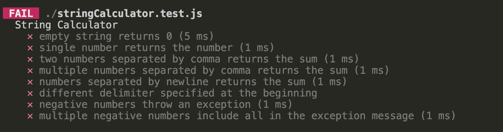
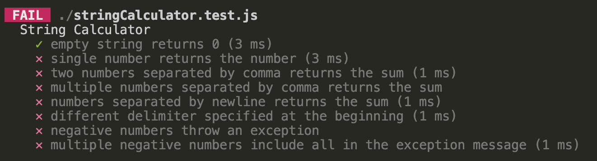

# String Calculator

This project is a basic Node.js application set up with Jest as the testing framework. Follow the steps below to set up your project and configure Jest for testing.

## Step by Step Process Followed

### 1. Created a New Directory

```bash
mkdir string-calculator
cd string-calculator
```

### 2. Initialized a New Node.js Project
```bash
npm init -y
```

### 3. Installed Jest as a development dependency:
```bash
npm install --save-dev jest
```

### 4. Configured Jest
Updated the `package.json` file to configure Jest as testing framework. Added following to the "scripts" section.
```javascript
"scripts": {
  "test": "jest"
}
```

This will help us run script with `npm test` or `npm run test`. 

### 5. Created .gitignore
I generated a `.gitignore` file using the `gitignore` package to ensure that unnecessary files are excluded from version control like github/gitlab. This helps keep the repository clean by avoiding the inclusion of files such as `node_modules` and environment configurations. To create the `.gitignore` file, I used the following command:
```bash
npx gitignore node
```

### 6. Test Cases and Starting method
I wrote comprehensive test cases for the project and included a method to facilitate starting the tests. After executing the `npm test` command, the output indicates that all the tests are currently failing.

You can review the output from the test run in the image below:



**First Test Pass Implementation**
After implementing the solution for the first test case, it passed successfully while the remaining tests are still failing. We will now focus on addressing the second test case.

Below is the output showing that the first test case has passed:




